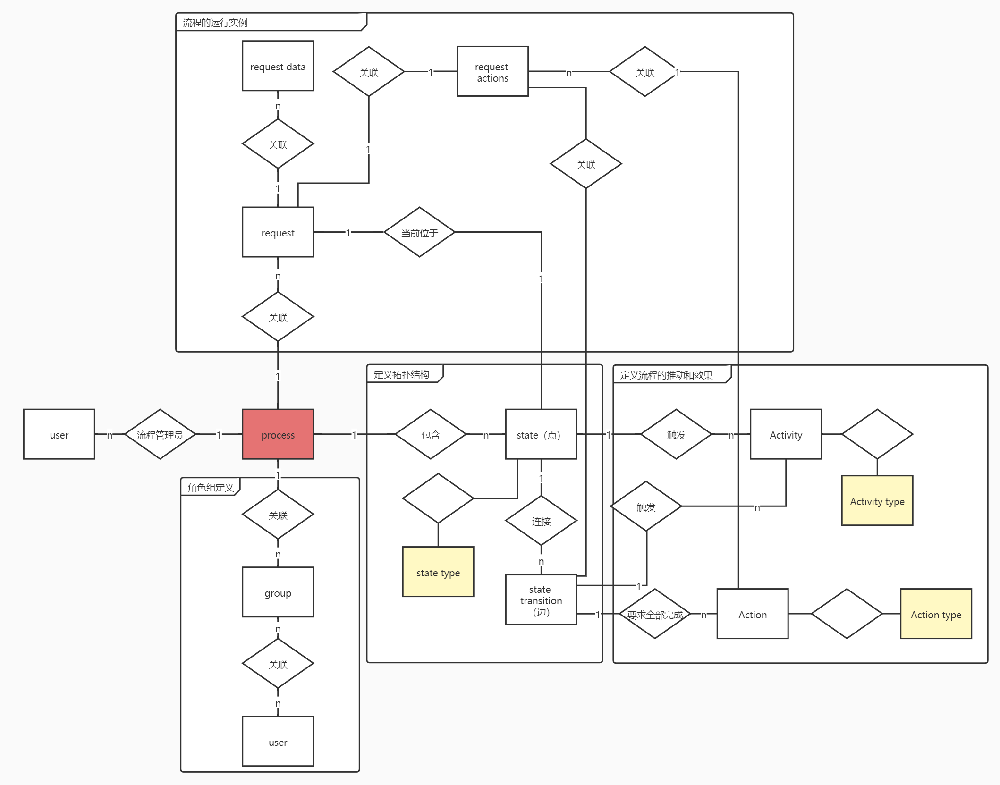

# ToyFlow

- [ToyFlow](#toyflow)
  - [Intro](#intro)
  - [Document](#document)
  - [Design](#design)
    - [database](#database)

## Intro

一个工作流管理引擎（服务）

Reference: [Designing a Workflow Engine Database](https://www.exceptionnotfound.net/designing-a-workflow-engine-database-part-1-introduction-and-purpose/)

- 流程管理
  - 流程拓扑结构存储和管理
  - 状态转移 `Action` 和事件触发 `Activity` 管理
  - 流程（如审批）角色定义
- 流程运行
  - 以键值对的形式存储流程附属信息、工单
  - 事件驱动的流程推动，即报告事件，该服务即返回当前状态, 下一步可以（应该）执行的 `Action` 和触发的 `Activity`

## Document

- 定义新流程
  - 定义拓扑结构(点: 状态, 边: 状态转移)
  - 定义 Activity (optional) 和 Action (每条边至少一个)
  - 定义流程角色组, 组多对多关联用户
- 开启/推进流程
  - 定义 Request 
  - 附加 RequestData
  - 事件驱动

## Design

### database 

