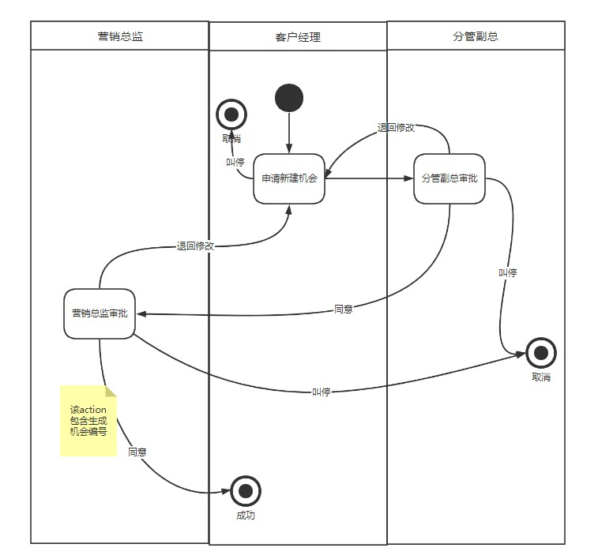
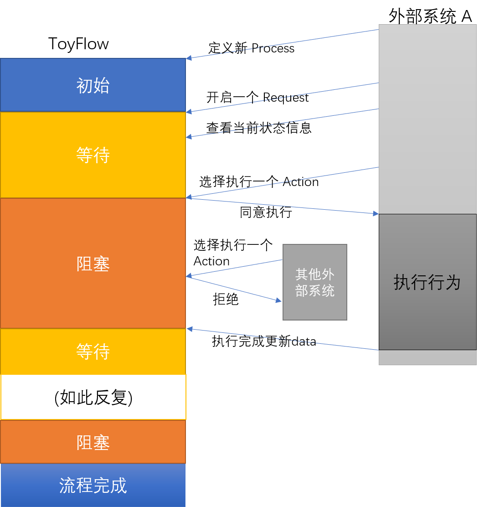
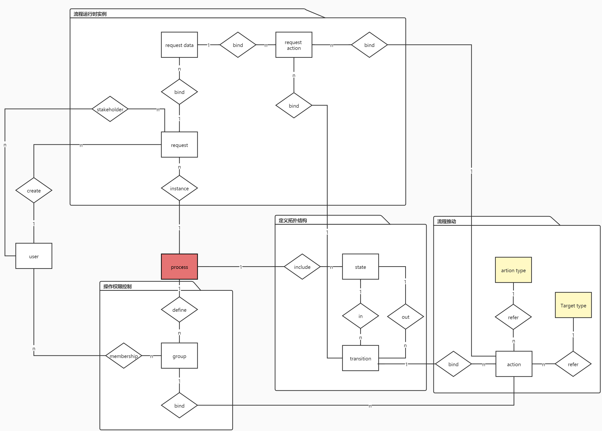

# ToyFlow

## Intro

一个工作流管理引擎（服务）

Reference: [Designing a Workflow Engine Database](https://www.exceptionnotfound.net/designing-a-workflow-engine-database-part-1-introduction-and-purpose/)

(但该文章有些逻辑问题无法理解)

ToyFlow 能做什么?

- 流程管理
  - 流程拓扑结构存储和管理
  - 状态转移 `Action` (已实现) 和事件触发 `Activity` (还没实现) 管理
  - 流程（如审批）角色定义
- 流程运行
  - 以键值对的形式存储流程附属信息
  - 事件驱动的流程推动，即报告事件，该服务即返回当前状态, 下一步可以（应该）执行的 `Action` 和触发的 `Activity`

## Document

      
### 概念

- **流程 (Process):** 是对一个流程如何执行的定义, 定义一个 Process 需要定义一个 Mealy 状态机的拓扑结构, 和如何推动流程进行
- **状态 (State):** 状态机中的节点
- **状态转移 (transition):** 状态机中的有向边
- **操作 (action):** 一个状态转移, 需要绑定至少一个操作, 绑定多个操作时表示需要这 **几个操作全部完成** 才能完成状态转移
- **操作组 (Group):** 流程中, 每个操作是需要特定的人来操作的, 如一个文件由 **客户经理** 起草, 再由 **分管副总, 营销总监** 审核通过, **客户经理, 分管副总** 和 **营销总监** 就是三个操作组



- **操作分发目标 (Action Target):** 操作的可执行范围是什么, 分为: 
  
  - `仅限发起者`
  - `仅限干系人`
  - `所有人`

  在确定谁可以执行一个操作时, 先确定当前 Action 的操作组, 再在该组内按照 Group Target 确定范围.
  
  与 Group 不同, Group 是随着不同 Process 而有不同定义的, 而 Target 是一个全局通用的静态划分, 对所有流程 (Process) 都是一样的
- **请求 (Request):** 一个运行中的流程实例, 也可以理解为在流程状态机上移动的游标, 它会附带一些数据, 称为 **Request Data**

### 交互模型: 一个 request 的生命周期



### 数据层实体抽象设计 


 
### 基本使用

- 定义新流程
  - 定义拓扑结构(点: 状态, 边: 状态转移)
  - 定义 Activity (optional) 和 Action (每条边至少一个)
  - 定义流程角色组, 角色组多对多关联到用户
- 开启/推进流程
  - 定义 Request 
  - 附加 RequestData
  - 按照交互模型, 事件驱动

### API 文档

- 开启流程
  - 本质上新建一个 request
    - 指定一个已有的 process
    - request 发起人 user id
    - request 时间 (默认自动生成)
    - 添加干系人
  - 返回
    - 成功与否
  - 具体设计:
    - 输入
    类型: `POST`

    ```json
    {
        "procID" : "",  // 指定的process, 字符串, 长度 20, 必须
        "name": "",
        "time": "",     // 发起时间, datatime 格式, 不必须, 默认录入数据库的时间
        "externalID": "", // 发起人外部 ID, 字符串, 长度 100, 必须
        "stakeholders": [ // 干系人, worker_id的列表, 可选, 至少包含发起人, 为空则只有发起人
            
        ],
    }
    ```
  - 返回:

    ```json
    {
        "stateCode": "200", // 状态码, 数字, 目前 200 为正常, 500 为失败
         "data": null
    }
    // 下面所有失败反馈都是这个:
    {
        "stateCode": "500", 
        "data":{
            "reason":"",                    // 失败返回失败原因说明 
            "detail":"NullPointerException,......" // trace detail
        }
    }
    ```

- (外部系统需要自己记得哪些人是干系人, 干系人与哪些流程有关, 以及这些流程的中定义的 `action` 编号在外部系统中对应怎样的处理方式, 在加载干系人的操作页面时, 向 `toyflow` 询问当前 `request` 的状态)
- 干系人询问状态
  - 入参
    - 干系人信息: 这里使用 worker_id 做唯一标识
  - 返回:
    - 当前节点 (`state`) 编号
    - 当前节点类型(`state_type`)
    - 该干系人可以做哪些 `action` (给出 `action` 编号)
  - 具体设计
    - 请求:

    method: `GET`

    ```    
    http://<host:port>/<domain>/{external_id}
    ```

    返回:

    ```json
    {
        "stateCode": "200",
        "data": {
            "requests": [
                {
                    "id":"",
                    "procID":"",
                    "procName":"",  // 流程的名称 
                    "reqName":"",   // 该流程实例的题目
                    "requestTime":"", 
                    "requesterExterID": "",
                    "currStateID":"", // 
                    "currStateName":"", // 状态名称
                    "currStateType":"", // 状态类型
                    "requestActions":[
                        {
                            "id": "",
                            "actionID":"",
                            "actionName":"",
                            "nextStateID": "",
                        }
                    ]
                }
            ]
        }
    }
    ```

- 干系人报告事件处理
  - 干系人获得它可以执行的 Actions 后, 做出了选择, 并将事件报告给 toyflow, 
  - toyflow 将检查选择是否合法(如: 在干系人做出选择前, 是否又有其他人做出选择, 将流程引向下一个状态), toyflow 将相应的更改 request actions 数据, 推动流程进行, 随后该 request 置位阻塞态
  - 入参:
    - 选择的 requestID 和 requestActionID

        method: `PUT`

    ```
    http://<host:port>/<root-path>/{externalID}/{requestID}/{requestActionID}
    ```

    - 返回:

    ```json
    {
        "stateCode": "200",
        "data": {
            "valid": true, // 如果可以执行
            "requestData":{
                "key1": "value1",
                // ......
            }
        }
    }
    ```

- 干系人 action 完成报告
  - 干系人处理完后, 报告给 toyflow , toyflow 将相应的 request 置为非阻塞, 并返回当前状态 (相当于再次查询状态)
  - 入参:
    - requestID 

      method: `PUT`

    ```
    http://<host:port>/.../{externalID}/{requestID}/{requestActionID}
    ```

    body 是更新后的 requestData 键值对:

    ```json
    {
        "key1": "value1",
        // ......
    }
    ```

  - 返回: 如果requestID确实是被ExternalID指定的user阻塞 则解开阻塞, 将requestAction 设为 completed, 并检查, 对于一个transition是否都已经完成, 若完成, 则都置为非 active
  
    ```json
    {
        "stateCode": "200",
        "data":{
            "requests": [
                {
                    "id":"",
                    "procID":"",
                    "procName":"",  // 流程的名称 
                    "reqName":"",   // 该流程实例的题目
                    "requestTime":"", 
                    "requesterExterID": "",
                    "currStateID":"", // 
                    "currStateName":"", // 状态名称
                    "currStateType":"", // 状态类型
                    "requestActions":[
                        {
                            "id": "",
                            "actionID":"",
                            "actionName":"",
                            "nextStateID": "",
                        }
                    ]
                }
            ]
        }
    }
    ```
- 流程数据修改和查看
  - 在任何阶段都可以进行流程数据的查看
  - 只有获得 toyflow "通过" 的 user 可以进行流程数据的修改
- 流程数据requestData查看:
  - method: `GET`

    ```
    http://<host:port>/.../{requestID}
    ```

  - 返回:

    ```json
    {
        "stateCode": "200",
        "data":{
            "key1": "value1",
            // ......
        }
    }
    ```
